## 词法分析
### 英文分词
定义规则，单词还原，去掉过去式单复数等等，一般步骤是：
- 查词典， 如果词典中有该词， 直接确定该词的原形；
- 根据不同情况查找相应规则对单词进行还原处理， 如果还原后在词典中找到该词， 则得到该词的原形； 如果找不到相应变换规则或者变换后词典中仍查不到该词， 则作为未登录词处理；
- 进入未登录词处理模块
### 汉语分词
#### 交集型歧义(歧义切分字段处理)
定义：链长——一个交集型切分歧义所拥有的交际串的集合称为交集串链，它的个数称为链长。比如“结合成分子”，交集串集合为{合 成 分}，链长为3.
#### 组合型歧义
自序不变，但是“词”的边界不一样。例如“门/把/手/弄坏了”与“门/把手/弄坏了”、“研究生/活动”与“研究/生活/动”。

> 实际上交集型切分歧义与多义组合型切分歧义的出现比例约为12:1。并且集外未登录词的占比也很大，例如 “大不列颠及北爱尔兰联合王国”这些专属名词。

#### 汉语自动分词的基本原则
- 合并原则；语类无法由组合成分直接得到的字串应该合并为一个分词单位。分为两种情况需要合并：一是语法功能不符例如“好吃”“三七二十一”，二是内部结构不符例如“游水”。还有附着性语素需与前后词进行绑定例如“员”与“检察员、邮递员”进行绑定。
#### 汉语自动分词的辅助原则
一些辅助的操作规则。
- 一些有明显分割符标记的串应该进行切分。例如“上、下课”。
- 附着性语(词)素和前后词合并为一个分词单位，例如“吝”，“不吝”“吝于”
- 使用频率高或共现率高的字串尽量合并为一个分词单位。
- 双音节加单音节的偏正式名词尽量合并为一个分词单位，例如“国际线”、“贫困线”。
- 双音节结构的偏正式动词应尽量合并为一个分词单位。“ 紧追其后”。
- 内部结构复杂、合并起来过于冗长的词尽量切分。例如“太空/ 计划/ 室”等等。
## 分词、标注的评价方法
### 评价指标
- 正确率$P=\frac{n}{N}\times{100\%}$，N 为系统输出，正确的结果为n个。
- 召回率，测试结果中正确结果的个数占标准答案总数的比例。输出的正确的结果n，标准答案的个数为M个，则$P=\frac{n}{M}\times{100\%}$.$R_{OOV}$为集外词的召回率，$R_{IV}$是指集内词的召回率。
- F-测度值：正确率于召回率的综合值，我们一般取$\beta=1$，最终用这个评价：
$$\frac{{({\beta ^2} + 1) \times P \times R}}{{{\beta ^2} \times (P + R)}} \times 100\% $$
### 汉语分词的基本算法
最大匹配法$(MM)$ :
- 正向最大匹配算法(FMM)
- 逆向最大匹配算法(BMM)
- 双向最大匹配算法(MM)
#### FMM算法
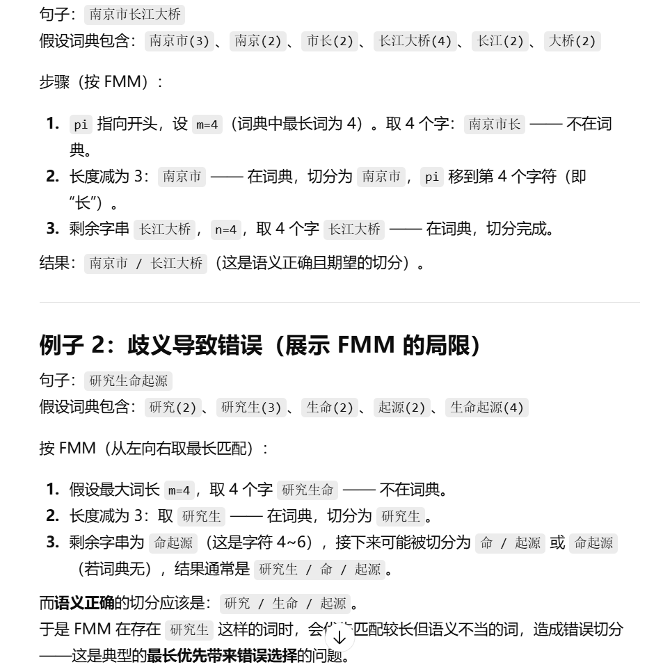
BMM与FMM只是方向上的区别，BMM是逆向遍历。这两者的效果高度依赖词典质量和最大词长的设定……BMM和FMM都不需要训练过程，也不涉及统计推断，其实现简单、运行速度快，在早期中文信息处理中被广泛使用。
- 优点：简单易行，开发周期短
- 弱点：歧义消解能力差。
#### 最少分词法
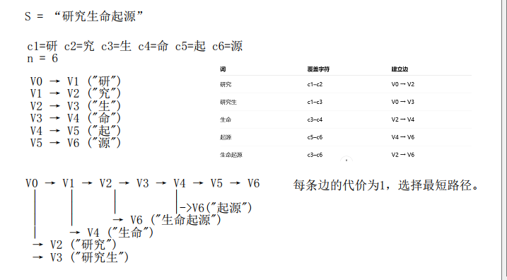

#### HMM
隐马尔可夫模型，属于统计概率模型。在 NLP 中，可观测序列通常是文本中的字或词，而**隐藏状态**往往是语法标签、词性标签，或分词任务中的位置标签（如 B、M、E、S），这正是分词任务中需要寻找的序列。
- 观测序列 ($S_w$)： 即我们看到的最终分词结果，比如 $w_1, w_2, \dots, w_n$。在模型看来，这些词是“输出信号”。
- 状态序列 ($S_c$)： 即词性（Part-of-Speech, POS）序列，比如 $c_1, c_2, \dots, c_n$（名词、动词等）。在 HMM 中，词性是隐藏的，我们看不见，但它们决定了生成的词。
- 模型参数 ($\mu$)： 包含了状态转移概率（一个词性后面接另一个词性的概率）和发射概率（某个词性产生某个具体词的概率）。
$$\hat{S}_w = \arg \max_{S_w} p(S_w | \mu)$$

- 在给定模型参数 $\mu$ 的情况下，寻找一个分词序列 $S_w$，使得该序列出现的概率最大。
#### 全切分算法评价
优点是可以发现所有的切分歧义。但也很依赖打分模型和大量标注语料。
#### 最大匹配分词算法
简单的基于词表的分词方法，只需要少量的语言资源即可进行开发，周期短，但是无法对于歧义进行有效的辨识。
# 文本分类
N-gram模型不能表示语言的结构或含义等深层问题，将本文划分到特定的主题下或许能够更好地提供判断。

- 流程：
	- 预处理：去除HTML标签，高频词"the"、"this"这些，因为高频词往往携带较少信息，并且提取词干(词的后缀和变形处理 将具有相同概念意义的词进行合并)
	- 文本表示：向量空间模型，词袋。
	- 分类模型：最近邻KNN 朴素贝叶斯
	- 评价：K折交叉验证(验证参数和模型的鲁棒性) 
	- 可选的：文本特征选取
## 预处理
去除HTML标签、去除停用词，形符化。
### 词的权重 
布尔权重、$tfidf$权重。
### 分类模型
#### knn
pros：
- 可以描述很复杂的分类边界 (非参数)
- 训练快速 (仅需要构建数据结构)
- 简单且好用 (e.g., 在computer vision中使用很多)
- 模型结果可解释性好(通过近邻观察)
cons：
- 存储开销大
- 样本不均衡的影响
- 参数空间很大时会导致搜索近邻很慢
- 不是“ 最好” 的分类器（性能上看）
#### 朴素贝叶斯
- 糟糕的条件独立性假设
- 词汇位置无关假设
- 不能融入较复杂的特征

> 神经网络分类模型(FastText TextRNN bert)在文本分类上与统计分类模型的比较和评估？统计分类模型：实现简单、收敛快、在小样本/稀疏短文本场景常能给出非常强的基线；可解释性好、资源消耗低。神经网络分类模型：适合语义复杂、数据规模较大的场景，存在上下文、长文本

# 语言模型Language model
语言模型的作用：对自然语言的概率分布进行建模，进行语句的合理性评估、词顺序的优化、词汇选择的辅助。
## 概率语言模型
给定字串，$w_{1},w_{2},\dots,w_{n}$，计算下一字$P(w_{1},w_{2},\dots,w_{n})$的概率的模型叫做概率语言模型。
- 如果考虑的前面的词个数很大， 则语料库中$C(w_{1},..., w_{m})$或$C(w_{1}, ..., w_{m-1})$极有可能为零， 这样就导致条件概率无法计算或无法计算.
- 一个可能的方案： 当前词的出现概率仅依赖于较短的历史词.
### n-gram
基于马尔可夫模型的假设，顾名思义，即当前词$x_{i}$的出现依赖该词之前$n-1$个词的出现。
$1-gram$:
$$p({w_1},{w_2}, \ldots ,{w_n}) = p({w_1})p({w_2}) \ldots p({w_n})$$
$2-gram$:
$$p({w_1},{w_2}, \ldots ,{w_n}) = p({w_1})p({w_2}|{w_1})p({w_3}|{w_2}) \ldots p({w_n}|{w_{n - 1}})$$
3-$gram$:
$$p({w_1},{w_2}, \ldots ,{w_n}) = p({w_1})p({w_2}|{w_1})p({w_3}|{w_2},{w_1}) \ldots p({w_n}|{w_{n - 1}},{w_{n - 2}})$$
由此可以扩展到更高阶n-gram的模型。实际应用中，3-gram最常用。

像$p(door|the)$这样的参数怎么估计？

> n-gram的优点是简单直观以实现、解释性强、高效，缺点是无法处理下述的稀疏问题，并且随着n的增加，数据概率$P$的存储指数级增长，还有就是长程捕捉能力差、没法考虑词的含义。（下文也有提及缺点）
### 数据稀疏
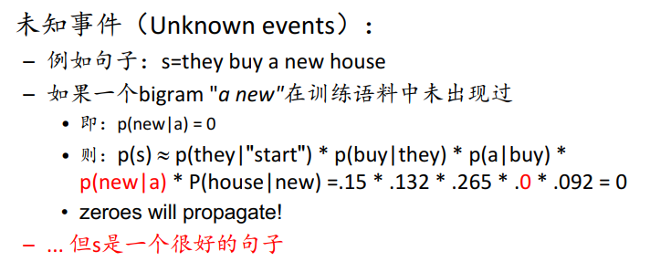

方法：
- 平滑，重新估计零概率和低值概率，赋予一个非零值
- 回退，高阶n-grams难以计算时，采用较低阶的n-grams来统计
$$
p(w_i \mid w_{i-2}, w_{i-1}) = 
\begin{cases} 
p(w_i \mid w_{i-2}, w_{i-1}) & \text{if } C(w_{i-2}, w_{i-1}, w_i) > 0 \\
\alpha_1 p(w_i \mid w_{i-1}) & \text{if } C(w_{i-2}, w_{i-1}, w_i) = 0 \text{ and } C(w_{i-1}, w_i) > 0 \\
\alpha_2 p(w_i) & \text{otherwise}
\end{cases}
$$
#### Laplace Smoothing
Laplace平滑（Add - one）是最朴素的平滑方法：
- 给没出现过的词/词对“补概率”（从0到非零）；
- 给已出现过的词/词对“降概率”（把原本的高频率稍微压一压）。
#### Lidstone smoothing
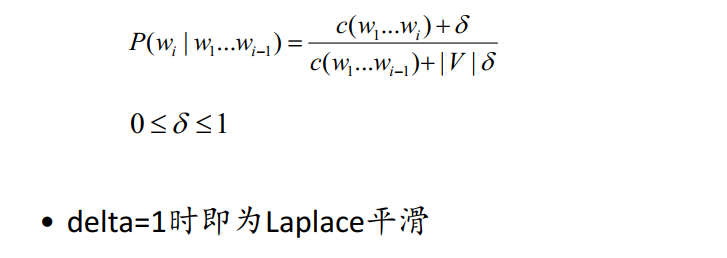
#### Good-Turing smoothing
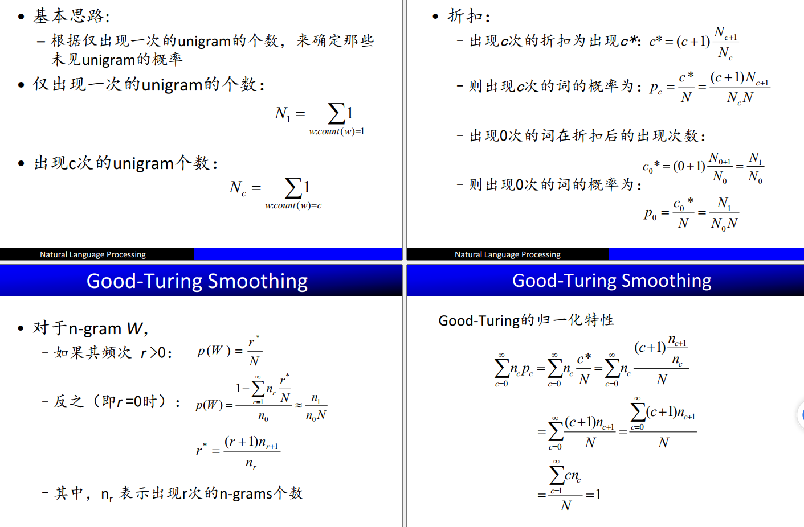
### 模型质量评价
>一个好的语言模型应该给实际使用的句子打较高的概率。

#### 困惑度
$P(W)$的几何平均值的倒数。表示语言模型在“猜下一个词”时，  平均每一步有多少种等可能的选择。PP 越小 → 模型越不迷茫 → 模型越好，PP 越大 → 模型越懵 → 模型越差。

$$PP(W) = P(W)^{-\frac{1}{N}} = \left[ \prod_{i=1}^{N} P(w_i | w_{i-1}) \right]^{-\frac{1}{N}}$$
若W中都是正确的句子，则P(W)应该具有较高的概率，困惑度较小。unigram的PP很大，因为其完全不看上下文。

>为什么是几何N次方根？模型会给整个句子 W一个概率 P(W)，句子越长，概率必然越小，因而不能直接比 P(W)。

#### 信息熵
$q$:真实语言的概率分布（上帝视角），我们只能用模型的预测概率$p$近似。下面是一个词串的信息熵：
$$H(W) = -\sum q(w_1 \dots w_N) \log_2 q(w_1 \dots w_N)$$
平均到一个字符：
$$H(w) = -\frac{1}{N} \sum q(w_1 \dots w_N) \log_2 q(w_1 \dots w_N)$$
极限形式反映语言本身有多不可预测
$$H(L) = -\lim_{N \to \infty} \frac{1}{N} \sum q(w_1 \dots w_N) \log_2 q(w_1 \dots w_N) = -\lim_{N \to \infty} \frac{1}{N} \log_2 q(w_1 \dots w_N)$$
当发生概率接近为1时，事情几乎“必然发生”，你一点都不惊讶。概率越高，对信息熵的贡献反而越小；概率越低，贡献的信息量越大。信息熵刻画的是不确定性而非频率。unigram->bigram->trigram->4 gram，困惑度逐渐降低。

#### n-gram模型的局限
- 没有考虑词的相似性
- 数据稀疏问题
## 其它语言模型
$P(C)$为语言模型，$P(S|C)$为生成模型。
$$\widehat C = \mathop {\arg \max }\limits_C P(C)P(C|S)$$
#### CBOW and Skip gram
Word2vec 是一种基于神经网络的生成词嵌入的方法，词嵌入是捕获其语义和关系的单词的密集向量表示。实现 Word2vec 有两种主要方法：
- CBOW是连续词袋模型，本质给定上下文词，预测中间的目标词。CBOW模型不是顺序的，也不一定是概率性的。
- Skip-gram的任务是给定目标词预测上下文词。即在给定target words的情况下，skip-gram模型使得context words出现的概率最大。
#### Neural net language model
#### 预训练语言模型
### 基于语言模型的分词方法
将词序列变为类序列。是一个“用词类语言模型约束结构，用生成模型约束合法性，通过贝叶斯决策进行中文分词与实体识别”的统计框架。
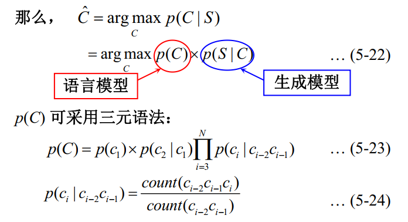

# 句法分析
两种不同的句法结构：依存结构（词与词之间的依赖关系）和短语结构（将句子表示成嵌套的短语成分，父节点将子节点组合成较大的短语单元）。输入是句子，输出是句法树，句法树中的信息有词的词性类别、短语、有用的关系。可以用于判断句子是否合乎给定的语法，识别句子各部分是如何依据语法规则组成合法句子，同时生成语法树。
## 上下文无关文法CFG
### 上下文概率无关文法PCFG
表示为$G=\{T，N，S，p，q\}$，T为终结符，N为非终结符，S为起始符，p表示产生式(重写规则)，q为概率函数。
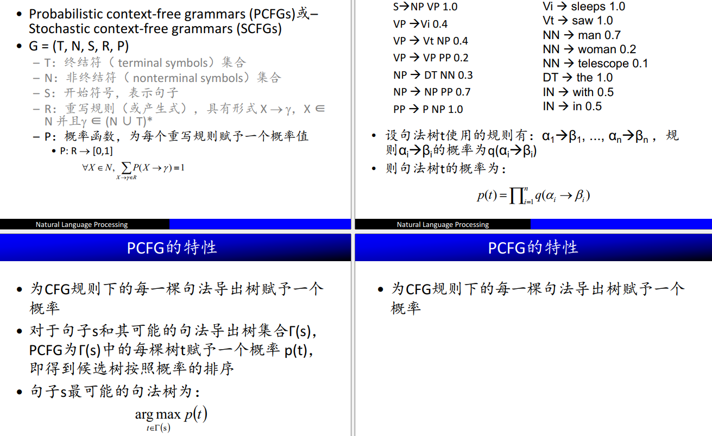
那么如何学习PCFG的概率？一个是从treebank中进行统计学习，估算
$${q_{ML}}(\alpha  \to \beta ) = {{Count(\alpha  \to \beta )} \over {Count(\alpha )}}$$
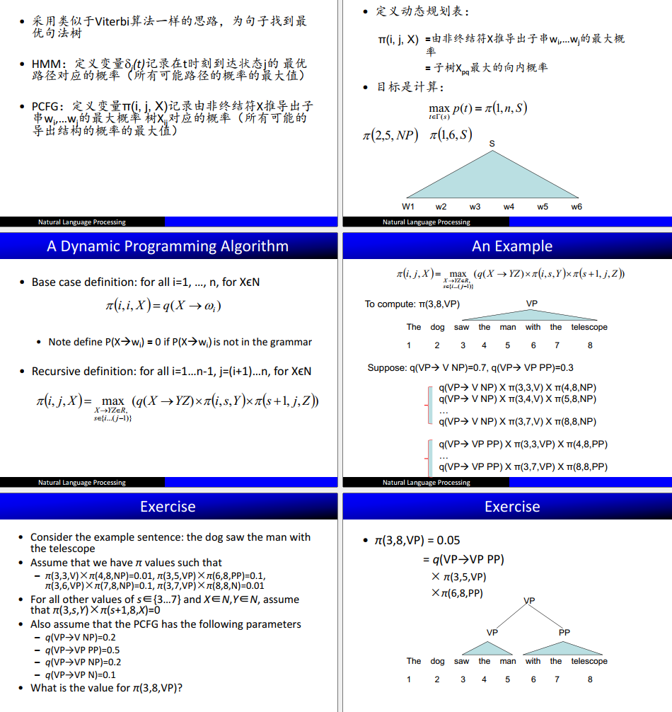

PCFG有一些weakness：
- 非终结符规则的应用不使用词汇信息。也就是规则是否被用，用的好不好只和“符号类型”有关，和“具体是什么词无关”
- 对超出父子节点关系之外的结构差异不够敏感。
## 上下文相关文法CSG 
### 概率相关文法PCSG
## 依存句法分析
无标记依存正确率与有标记依存正确率都将根节点纳入计算，依存正确率不将根节点纳入计算。
## 句法分析的评价
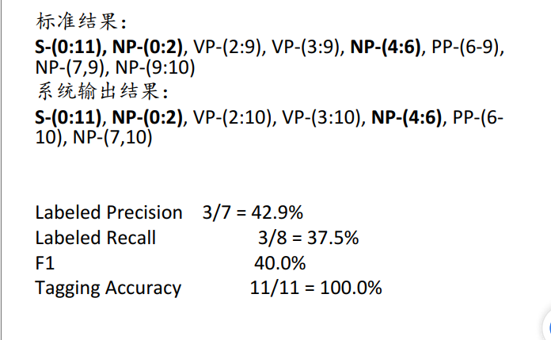


## 格语法
格语法中的格是“ 深层格” ， 它是指句子中体词(名词、 代词等)和谓词(动词、 形容词等) 之间的及物性关系(transitivity)。
三条基本规则：
$$\eqalign{
  & S \to M + P  \cr 
  & P \to V + {C_1} + {C_2} + {C_3} +  \ldots  + {C_n}  \cr 
  & C \to K + NP \cr} $$
```
Sentence : The young athletes will be running in playground next week.
Verb:Break
	Case-Frame:[
	Agentive: the young athlete
	Locative: playground
	Neutral: the young athlete
	[Modal
		[Tense: future     (将来时)
		MOOD: Declarative （陈述语气）
		Time: next week]]]  
```
## 语义网络
## 概念依存理论
CD理论。定义了三个层次：动作基元、剧本和计划。
## 词义消歧
有监督的词义消歧方法总体思路是建立分类器，划分多义词的上下文类别的方法来区分多义词的词义。其中有**基于互信息的消岐方法**，假设我们有一个双语对齐的平行语料库，以法语和英语为例， 通过词语对齐模型每个法语单词可以找到对应的英语单词， 一个多义的法语单词在不同的上下文中对应多种不同的英语翻译。

在基于词典的消岐方法中，分为基于语义定义的词义消歧方法（词典中词条本身的定义作为判断其语义的条件）、基于义类辞典(thesaurus) 的消歧（不同义项的上下文语义类不同）、基于双语词典的消歧、Yarowsky 消歧算法。

无监督的消岐方法，典型代表为上下文分组辨识方法：
- 上下文分组辨识对于一个具有$k$ 个义项的词w， 估计使用义项 $s_{i} (k\geq i\geq1)$ 的上下文中出现词$v_{j}$ 的概率， 即 $p(v_{j}|s_{i})$。已知某个意项，将上下文的搭配的特定词汇也一起有信息化了。
- 基于向量的词义标注：对于词汇集中的每一个词都做了上下文的关联向量的表示。
$$A(w) = \sum\limits_i^n {\delta ({w_k},{w^j})\langle c_k^1,c_k^2, \ldots ,c_k^V\rangle } $$
上标表示词汇集中的词形(type), 如$w^{j}$ 表示词汇集中的第$j$ 个词；下标k表示一个词在语料库中的一次具体使用， 简称为“ 词用(token)” ， $w_{k}$表示语料库中的第k 个词； n为词的个数，即语料库大小； 为词形 出现在$w_{k}$ 的上下文中的次数；$\delta(,)$ 为Kronecker 函数。

也就是说，当对于词汇集中的字$w^{j}$，在语料中寻找相同的token，$\delta$在相等时置1.当词汇集中的字与语料词匹配上时，统计上下文特定长度（例如±2，那么<>符号中就有4个数据）的窗口中，词汇集中所有词|V|在这个窗口出现的次数，编码成长度为V向量。求和符号表示一个长度为n的语料中，可能不止一次出现$w_{k}=w^{j}$的情况。
## 语义角色标注SRL
基本任务是以句子为分析单位，以句子中的谓词为核心，分析句子中的其他成分与谓词之间的关系。主要用途是信息抽取、自动文摘和机器翻译等。

基于短语结构句法分析的SRL方法,PPT中只讲了候选论元的识别。例如下图3，从谓词“调查”开始不断判断VV的兄弟节点，企图添加进候选论元集合，然后不断向上迭代追溯到根节点IP。
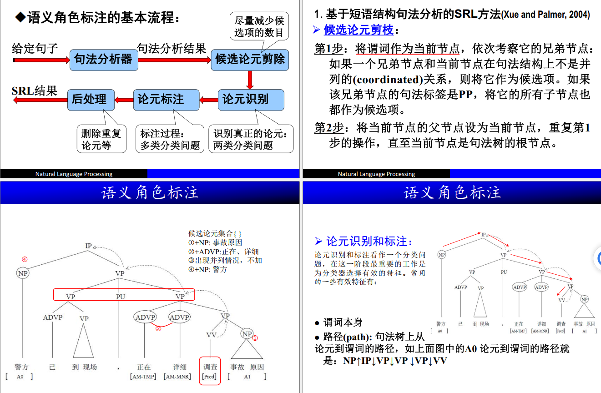


与基于短语结构的SRL方法将论元表示为连续的几个短语和一个语义角色标签(例如上图的ADVP VV)与不同的是，基于依存关系的SRL方法将论元表示为一个中心词与一个语义角色标签。谓词论元之间的关系可以表示为谓词与论元*中心词*之间的关系。
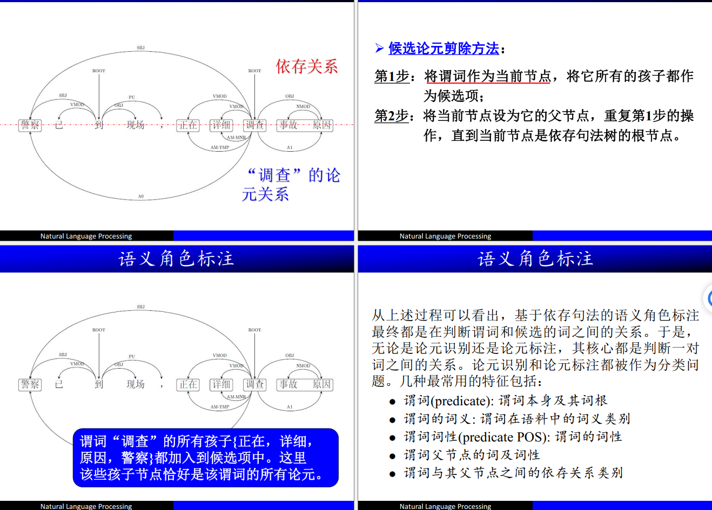

基于语块分析的SRL方法中，其用语块分析(Chunking)的结果来进行语义角色标注。 谓词——论元关系的表示方法与基于短语句法分析中的表示方法相同， 每一个论元都表示为连续的几个词。扁平化标注，利用到初级的短语结构分析的结果。
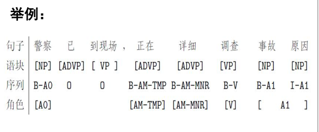

> 篇章分析的层面：词汇之间的衔接性、句子之间的连贯性、单元之间的有组织性。
# 机器翻译
## 基本翻译方法
- 直接转换法
- 基于规则的翻译方法（也叫基于转换的翻译方法，过程为：独立分析-独立生成-相关转换），分为六个步骤。
	- PPT上主要讲的是利用转换规则将源语言句子结构（句法树）转换成目标语言句子结构。
- 基于中间语言的翻译方法  
- 基于事例的翻译方法
## 统计机器翻译
噪声信道模型：假设源语言句子是由某个目标语言句子经过噪声信道传播得到， 使用Bayesian方法来找到最可能产生该源语言句子的目标语言句子。
$$\widehat e = \mathop {\arg \max P(e|f)}\limits_{e \in English}  = \mathop {\arg \max P(f|e)P(e)}\limits_{e \in English} $$
我们的任务是将源语言($f$，foregin)翻译回英语$e$。$P(e)$是目标语言句子出现的概率，可以用n-gram计算，也可以从互联网语料库中得到。那么$P(f|e)$（Translation model）呢？如何统计已知英语句子的情况下出现法语对应句的概率？

翻译模型：对齐的表示符号`{}`中，index代表外文句子的index对应词，index对应的number代表英语原句的第n个词。
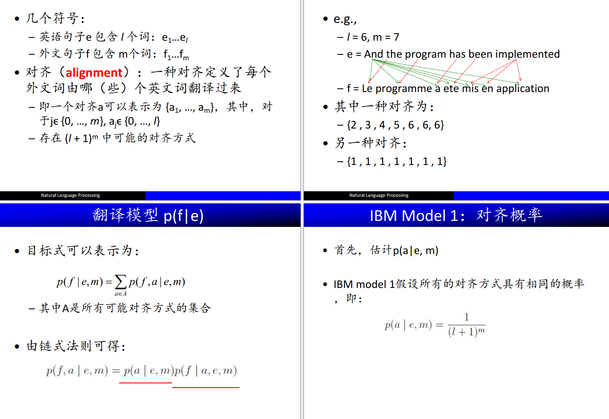
### IBM model 1 统计机器翻译模型
英语语言$e$，目标语言长度$m$，求翻译成外文句子$f$的概率$p(f|e,m)$，则有$p(f|e,m) = \sum\limits_{a \in A} {p(f,a|e,m)}$和$p(f,a|e,m)=p(a|e,m)p(f|a,e,m)$。

IBM model 1 假设所有的对齐方式具有相同的概率，即$p(a|e,m) = {1 \over {{{(l + 1)}^m}}}$。（分母 $(l+1)^{m}$表示目标语言每个词有 $l+1$种对齐选择：“对齐到源语言第 1,2,…,l个词”或“插入空词”，共 $l+1$类；$m$个目标词独立选择，故是幂次）

$$p(f|a,e,m) = \mathop \prod \limits_{j = 1}^m t({f_j}|{e_{{a_j}}})$$
给定对应关系$a$之后，源语言$e$的映射关系就十分清晰了，变为特定字到特定字的转换。其中$t({f_j}|{e_{{a_j}}})$表示英文词$e_{a_{j}}$翻译为外文词$f_{j}$的概率，可以通过统计获得。

其实也可以求对应关系$p(a|f,m,e)$：
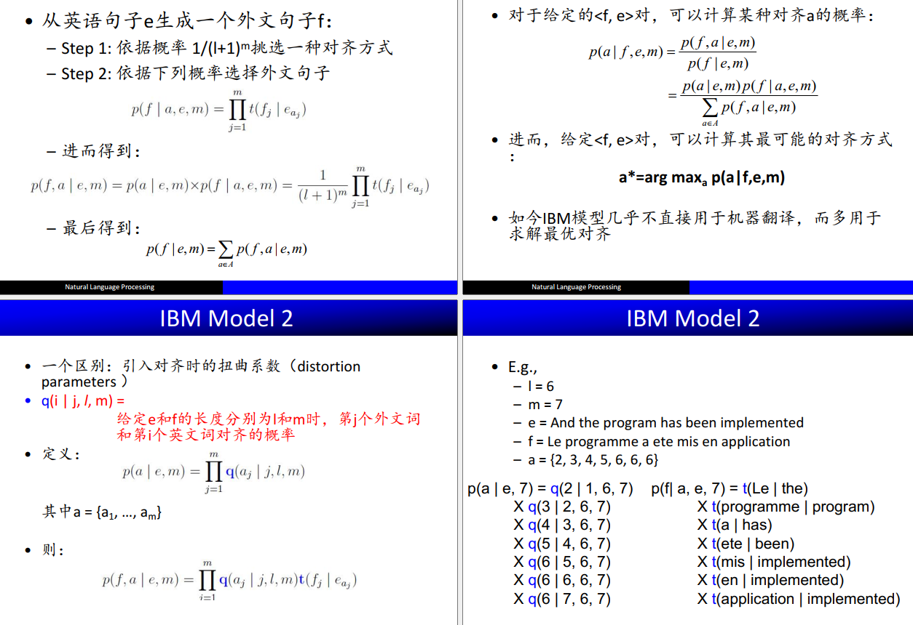
## IBM model 2
引入了对齐时的扭曲系数，将Model 1 的$p(a|e,m) = {1 \over {{{(l + 1)}^m}}}$修改成了如下形式：
$$q(a|e,m) = \prod\limits_{j = 1}^m {q({a_j}|j,l,m)} $$
本质也是连乘式，连乘$m$，则上述对齐关系就变成：
$$p(f|a,e,m) = \prod\limits_{j = 1}^m t ({f_j}|{e_{{a_j}}})p({a_{^j}}|j,m,l)$$
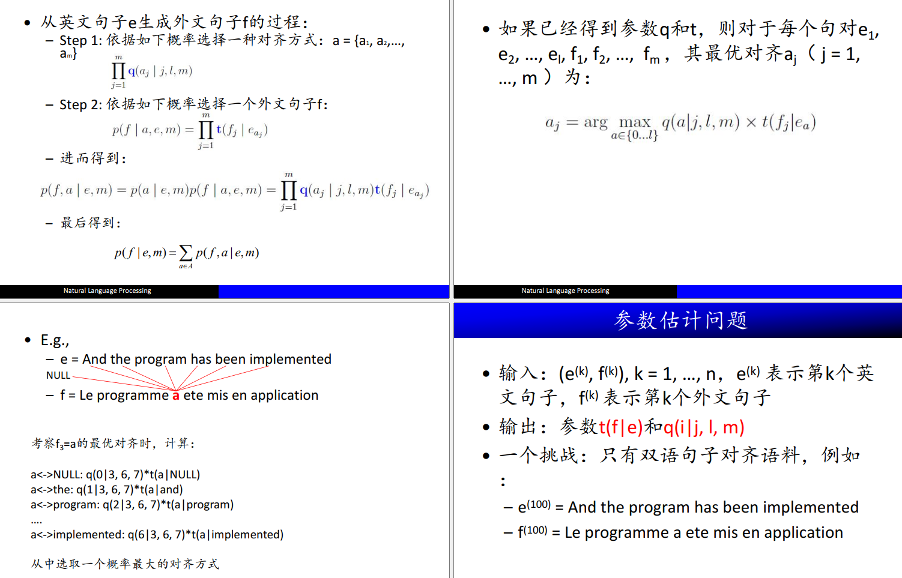

留意上图左下角。生成结果是翻译结果乘以对齐概率，需要掌握生成与翻译。

## 神经机器翻译
循环神经网络：
$$\eqalign{
  & {h_s} = \tanh (UL({w_s}) + W{h_{s - 1}})  \cr 
  & {h_t} = \tanh (UL({w_t}) + W{h_{t - 1}}) \cr} $$
  $U$为一个矩阵，$L(w_{t})$表示字串$w_{t}$的向量编码。
# 信息检索(IR)与推荐
IR信息检索环境的三个基本构成：用户、检索、数据集。任务可以分解为：
- 文档索引：为文档集合中的文档构建索引
- 查询操作：处理用户的查询请求
- 检索：相似度比较及排序– 找到和查询请求最匹配的文档集（相关文档集）。
- 显示及优化： 结果展示。

文档索引有去除停用词的方法，根据预先定义的停用词词表， 直接从词典里去除停用词。停用词词表包括语气词等高频词，高频词往往区分不同概念和文档的能力较差。但整体趋势是不去除停用词，例如（各种音乐、 图书等实体的标题： "Let it be", "To be or not to be"也是有意义的）。

形符化：去除后缀，例如developing => develop。

词条文档矩阵：行词条，列文档index。整个矩阵的大小是$N\times M$。

倒排索引存储方法：$[name:12,24,65,76]$，name为词条，数字为词条出现在文档的页的索引。
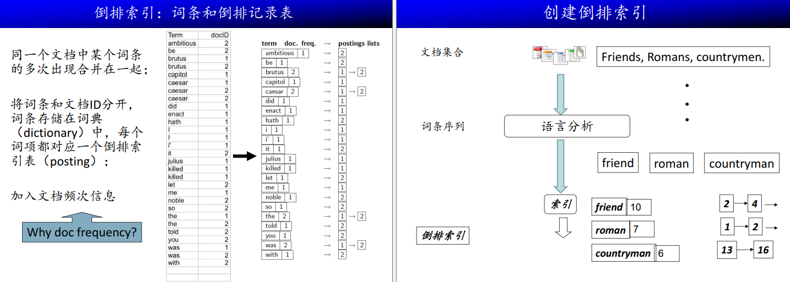
文档频率：不关心一个词在某篇文档中出现了多少次，只要出现 ≥ 1 次，这个文档就被计入，是一个“跨文档”的统计量，文档频率等于posting lists的长度。
## 相似度模型
### 布尔模型
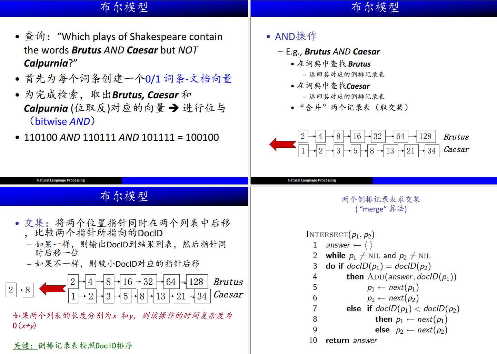
布尔模型simple的一个点在于词条与文档的匹配是硬性的，例如下图中对于词条stanford university的统计，university of stanford就不再Stanford university的统计中；另一个是对于文档与词条的相关程度不进行区分，只分为相关与不相关。
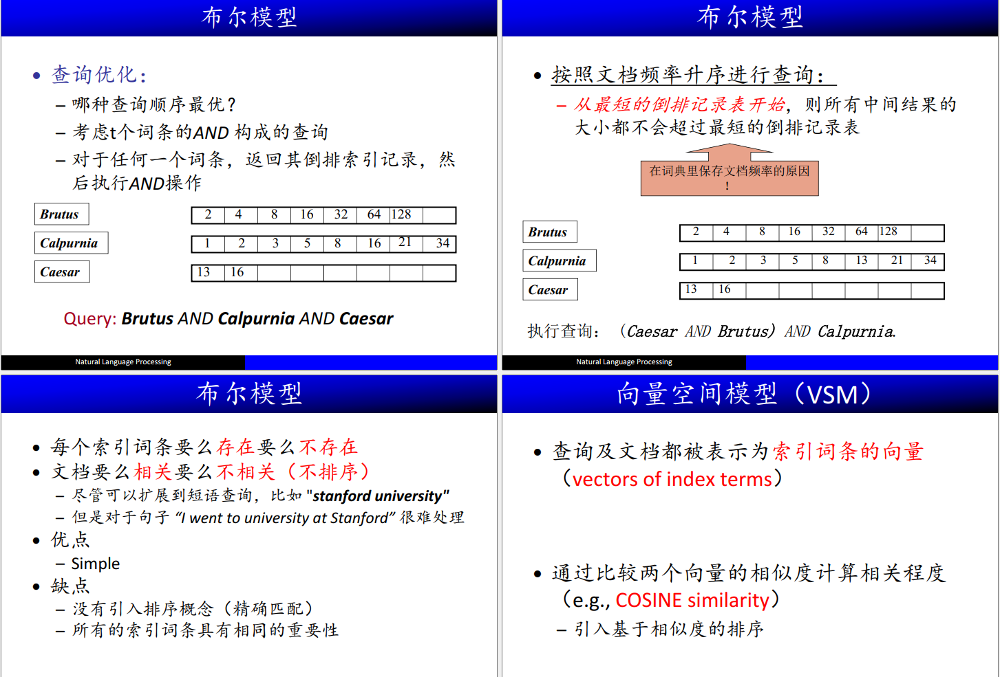
###  向量空间模型
- 查询及文档都被表示为索引词条的向量(vectors of index terms)
- 通过比较两个向量的相似度计算相关程度(cosine similarity)
向量空间模型，简而言之，即是在词条文档矩阵中，填充的值不是“出现”和“未出现”的0和1，而是$tfidf$指标。
$$tfid{f_{i,k}} = {f_{i,k}} \times \log ({N \over {d{f_i}}})$$
上式中，$f_{i,k}$代表词条$i$在文档$k$中的出现频次，$df_{i}$代表该词条总共出现在多少的文档中，$N$为文档总数。
### 概率模型

### 语言模型
给定一个查询 query，哪些文档“最有可能生成这个 query”？
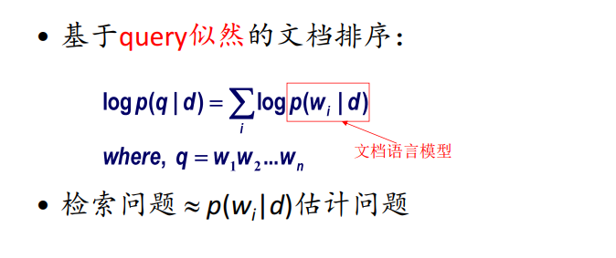
其中$w_{i}$为query词序列的组成。将IR 的关键，从“匹配多少词”，变成了“文档语言模型给查询词多大概率”。
## IR评价
- 信息的覆盖率 → _Recall_
- 信息的正确率 → _Precision_
- 结果的呈现形式 → 是否排序合理、相关文档是否靠前
- 时空效率（响应时间、索引大小）
- 用户体验（是否“前几条就有用”）
Recall代表的是，在所有人工标注为相关的文档中，模型找出了多少。Precision表示的是，在所有模型找回的文档中，有多少是相关的。

平均正确率均值MAP：
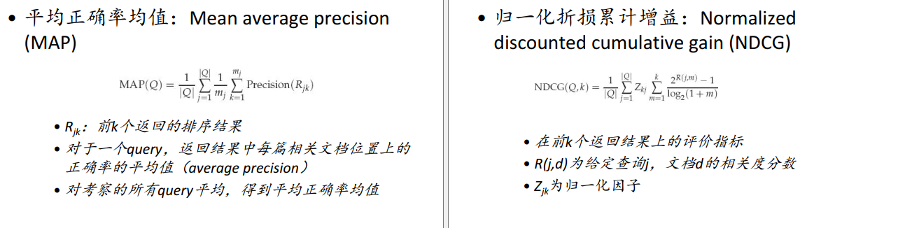
关于为什么Precision需要求平均，对于不同的k都要计算准确率：
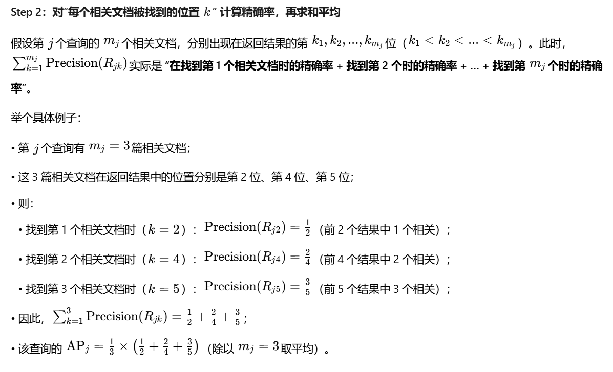

## 推荐系统RS
推荐系统需依次完成3个核心环节：
- 收集已知评分：构建“效用矩阵”，需解决“显式/隐式评分采集”（如用户主动打分是显式，行为轨迹推导为隐式）；
- 推断未知评分：从已知评分预测用户对未评分物品的偏好，核心聚焦“高价值未知评分”；  
- 评估推断方法：衡量推荐算法的性能与效果。
### 技术方向一：基于内容过滤
- 提取“物品画像（Item profile）”：分析用户喜欢的物品特征（如图中红色圆形、三角形），本质是特征向量，在文本挖掘领域中用tf-idf作为启发式策略用于筛选文本类物品的关键特征。
- 构建“用户画像（User profile）”：基于用户历史喜好，归纳其偏好的特征模式；
- 匹配推荐：找到与用户画像特征“匹配（match）”的新物品（如图中绿色圆形），实现个性化推荐，使用余弦相似度估计偏好程度。
优点是支持冷启动，对用户-物品交互的数据少的稀疏性可以进行解决，例如小众口味的用户喜好能够进行推荐，包括不流行的物品。缺点是物品的特征提取困难，难精准定义“特征”用于匹配，并且会忽略用户的多元兴趣无法利用其他用户，过于用户定制化了。
### 技术方向二：协同过滤 user-user CF
是“基于用户/物品的相似性”做推荐的思路，聚焦“用户间的行为相似性”来挖掘潜在偏好。
- 目标用户（如用户x）；
- 找到与$x$“评分相似”的其他用户集合$N$。使用余弦相似度、皮尔逊相关系数。
- 基于集合$N$中用户对于物品$i$的评分，预测目标用户对未交互物品$i$的评分（可以是简单平均和加权平均），进而推荐高预测分的物品。
#### item-item CF 相似度的计算评分要求掌握
对于物品之间的相似度，通过用户A对于其他已经接触过的物品BCDF的评分，计算用户A对于未接触过的物品E的评分。物品属性相对“简单稳定”（如电影的类型、导演等维度更固定），而用户兴趣多元复杂（同一用户可能喜欢动作、喜剧、科幻等多类电影）。

优点是对任意类型物品适用，无需提前做“特征选择/工程”（无需人工定义物品属性，纯靠用户交互数据）。
### 技术方向三：基于潜在因子LF
潜因子方法是一种通过“潜在特征空间”建模用户-物品交互关系的技术。其核心假设是：用户对物品的偏好（或交互行为，如评分、点击等）由用户和物品的“隐藏特征”（潜在因子）共同决定。

例如，在电影推荐场景中，“用户喜欢动作片”“用户偏爱诺兰导演的作品”可视为用户的潜在特征；“电影包含动作元素”“电影由诺兰执导”可视为物品的潜在特征。通过捕捉这些隐藏特征，能高效预测用户对未交互物品的偏好（如评分。
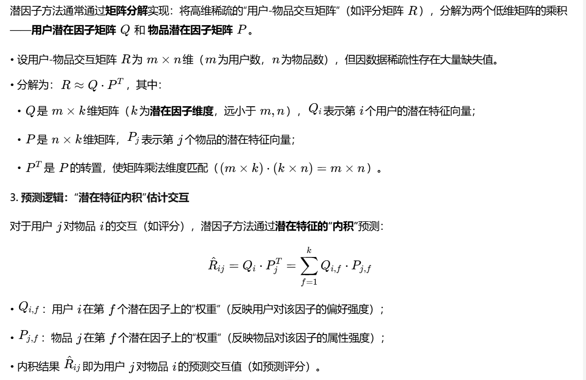
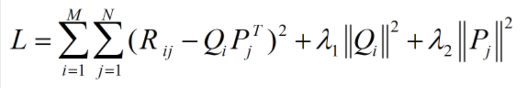

Pros：容易实现、预测精度比较高、扩展性好。Cons：结果的可解释性差。
# 人机对话
对话系统的主要任务：
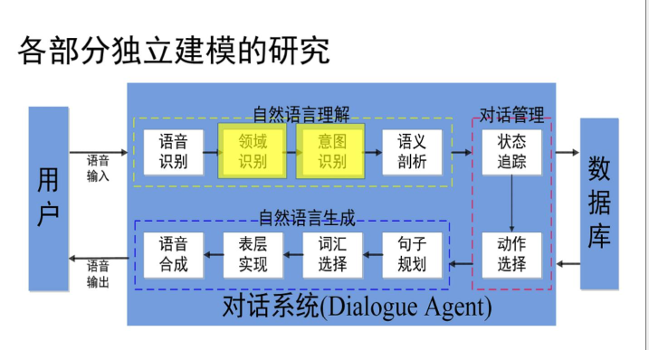
## 语义剖析
本质上是槽填充。识别用户输入中关键信息（如“地点、时间、实体”等，对应“槽位”），并确定其取值。任务分两类：
- 序标问题：“仅识别槽位”，例如“厦大”=》将B_D标注在厦， I_D标注在门，表示地点槽的起始与结束。
	- 数据充分时，可以基于RNN CNN对于模型进行优化，提升槽分类性能。
	- 数据不充分时，需结合外部资源或弱监督方法弥补数据不足，包括引入规则、语义等等。
- 分类问题：映射到标准描述——需将用户非标准表达匹配到预定义的标准槽值。例如“厦大”=》“厦门大学”
有一项挑战是，对于新槽植需要映射到标准集合的问题，上述两步的误差累积限制了性能。

对话状态追踪：生成模型缺陷、判别模型基于条件概率计算分布，$P(s|f)$，$f$为对话历史中抽取出来的特征。

## 动作选择（策略模型）
### 确定性对话状态下的策略模型-有限状态自动机(FSA)
不灵活、不丰富，系统主导对话过程、对话按预定策略进行。可以选择更丰富的MDP马尔可夫决策过程。
### 不确定性对话状态下的策略模型
POMDP——基于信念状态的MDP模型。

用户仿真器，增强机器的容错。
# 词性标注
> Rule-Based (基于规则的方法)： 人类专家根据词法及语言学知识编制的规则。
> Learning-Based (基于学习的方法)： 从专家标注的语料库中学习到用于自动标注的模型。

令$O$为词序列,Q为词性标注序列，则有目标：
$$\mathop {\arg \max }\limits_Q P(Q|O)= \mathop {\arg \max }\limits_Q P(O|Q)P(Q)$$
如下图，语言模型$P(Q)$可以使用概率语言模型n-gram。
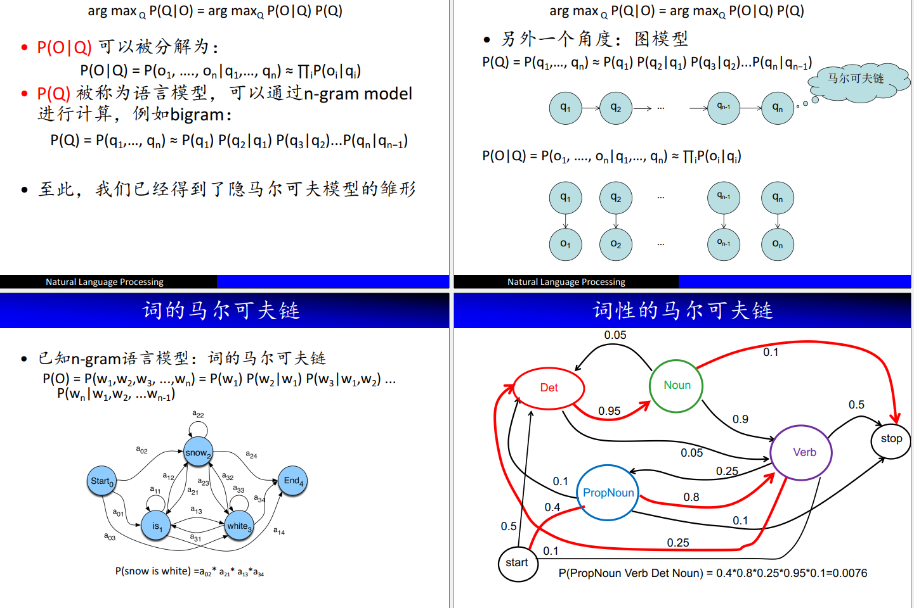
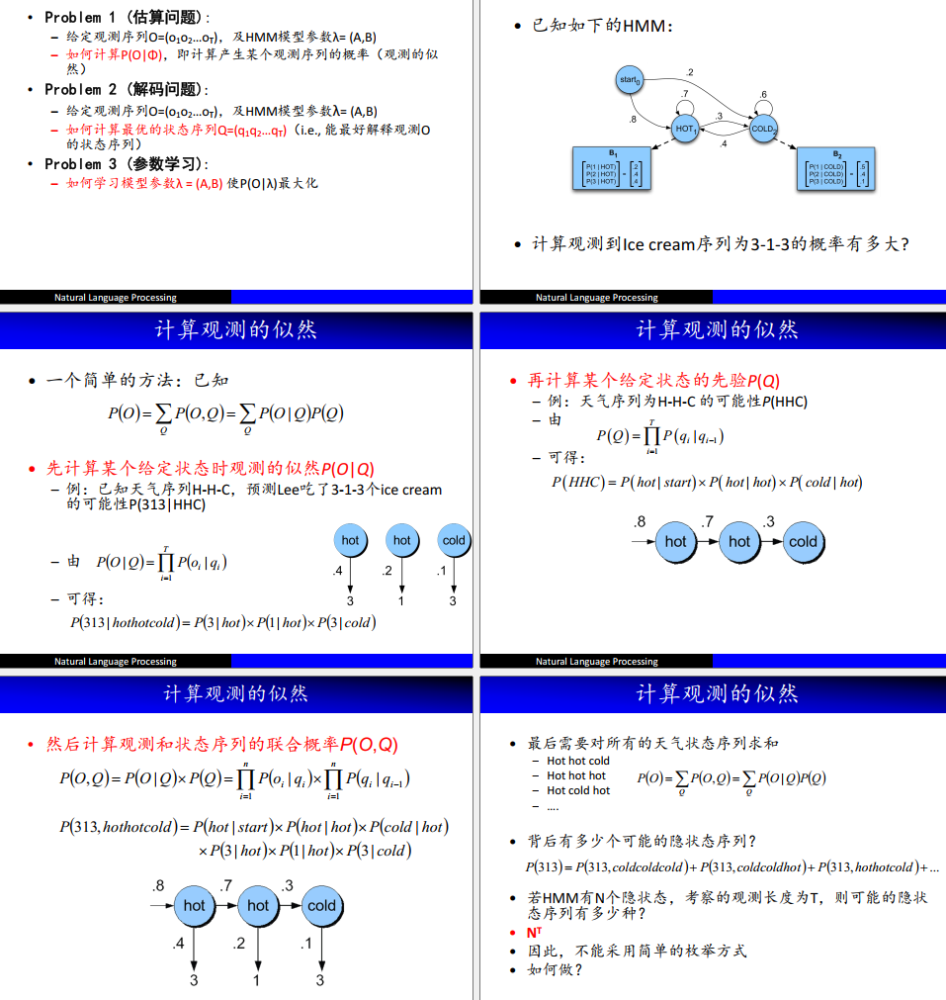
- 前向算法：
- 后向算法：
## HMM的三个基本问题
- 估算问题，如何计算$P(O|Q)$，即观测序列的概率
- 解码问题，给定观测，如何计算最优状态序列$Q(q_{1},q_{2},\dots,q_{T})$
- 参数学习,如何学习模型参数$\lambda$使得给定$\lambda$，观测O的概率最大化？（有监督 无监督）

# 神经网络语言模型
## FNN
- 词表映射，对于词表V中的词，映射得到每个m维的词向量。
- 训练的目标等价于n-gram的困惑度最小。
$$PP = (\prod\limits_{i = 1}^N {P(C({x_i})|C({x_{i - 1}}) \ldots C({x_{i - n + 1}})))} )$$
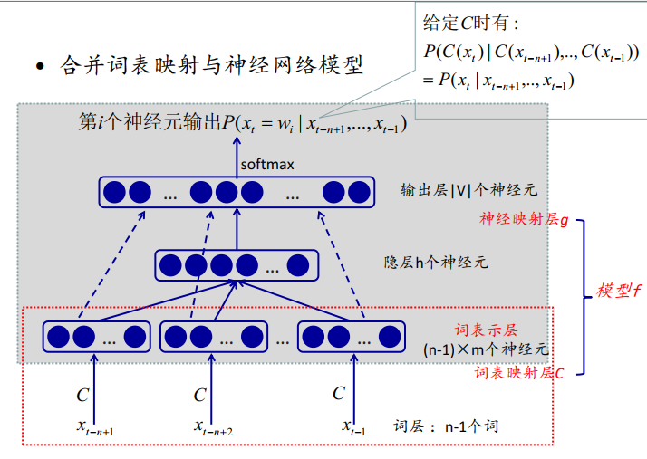
- 语言是时序，FNN不能反映时序关系。
- FNN需要固定输入长度，语言依赖关系可变。
## CBOW
通过上下文的环境来预测当前的词，对于目标词$w$及其上下文$C(w) = ({c_1},{c_2},{c_3},{c_4}):P(w|C(w))$。


## PLM 预训练语言模型
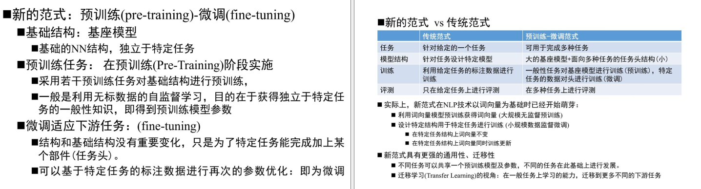
现代NLP预训练pipeline：
- 词向量的无监督预训练，即在大规模无标注文本（比如互联网爬取的海量新闻，没有人工打标签）上“自学”。模型靠文本自身的统计规律（比如“苹果”常和“手机”“水果”一起出现，就能学到语义关联），自动学习出每个词的向量表示。
- 预训练得到词向量后，要解决特定NLP任务，需设计“针对该任务的神经网络结构”，并在小规模带标签数据（人工标注好“这句话是正面/负面情感”的数据集）上训练。
	- 词向量固定，只训任务结构，只更新“任务专属网络结构”里的参数。
	- 词向量与任务结构一起训，词表示也跟着任务需求，再做一轮精细优化。

基于Transformer的预训练语言模型：
- Transformer编码器：采用双向预测的语言模型，典型代表是bert
- Transformer解码器：采用单向自回归生成的语言模型，纯解码器，GPT
- MLM，基于Mask的遮蔽预测任务，无需额外的标注数据，自然的语句就可以用来直接构建为训练数据。
- NSP，无需额外的标注数据，自然的语句就可以用来直接构建为训练数据。
